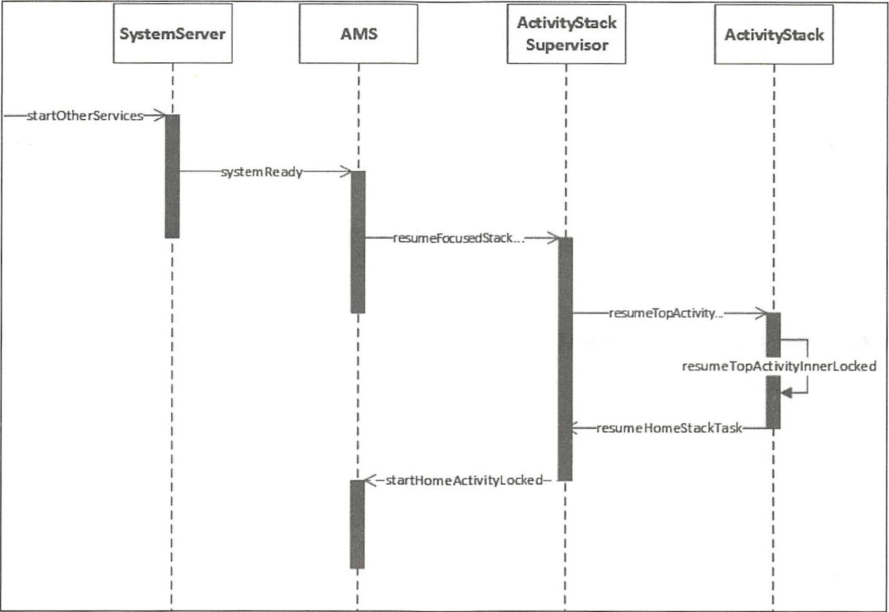

2.1 init 进程启动过程
init 进程是Android 系统中用户空间的第一个进程，进程号为1 ，是Android 系统启动
流程中一个关键的步骤，作为第一个进程，它被赋予了很多极其重要的工作职责，比如创
建Zygote （孵化器）和属性服务等。init 进程是由多个源文件共同组成的，这些文件位于
源码目录system/core/init 中。
2 .1.1 51λin it 进程
为了讲解init 进程，首先要了解Android 系统启动流程的前几步，以引入init 进程。
1. 启动电源以及系统启动
   当电源按下时引导芯片代码从预定义的地方（固化在ROM ）开始执行。加载引导程序
   BootLoader 到队M 中，然后执行。
2. 引导程序Bootloader
   引导程序BootLoader 是在Android 操作系统开始运行前的一个小程序，它的主要作用
   是把系统OS 拉起来并运行。
3. Linux 内核启动
   当内核启动时，设置缓存、被保护存储器、计划列表、加载驱动。在内核完成系统设
   置后，它首先在系统文件中寻找init.rc 文件，井启动init 进程。
4. init 进程启动
   init 进程做的工作比较多，主要用来初始化和启动属性服务，也用来启动Zygote 进程。
 从上面的步骤可以看出， 当我们按下启动电源时，系统启动后会加载引导程序， 引导
   程序又启动Linux 内核，在Linux 内核加载完成后，第一件事就是要启动init 进程。关于
   Android 系统启动的完整流程会在本章的2 . 5 节进行讲解，这一节的任务就是先了解init 进
   程的启动过程。
  
  2.1.2 init 进程的λ口函数
   在Linux 内核加载完成后， 它首先在系统文件中寻找init.rc 文件， 并启动init 进程，然
   后查看init 进程的人口函数main ， 代码如下所示：
  system/core/init/init.cpp
  int main(int argc , char** argv) {
  if (! strcmp (basename(argv[O ]), ” ueventd”)) {
  retur口ueventd main( argc , argv);
  if ( ! strcmp (basename (argv[O ]) ,”watchdogd”)){
  r eturn watchdogd main(argc, argv);
  if (REBOOT BOOTLOADER ON PANIC) {
  install_ reboot_signal_handlers ();
  add environment (” PATH”, PATH DEFPATH) ;
  bool is f 工rst_stage = (getenv (” INIT SECOND_ STAGE” ) == nullptr);
  if (is f 工rst stage) {
  boot clock : : time po 工nt start time = boot clock: : now() ;
  ／／清理umask
  umask(O) ;
  ／／创建和挂载启动所需的文件目录
  mount (” tmpfs”,”/ dev”,”tmpfs ” , MS NOSUID,”mode=0755”) ;
  mkdir (” / dev/pts ” F 0755) ;
  mkdi r (” / dev/socket ”, 0755 );
  mount (”devpts”,”/ dev/pts ” , ” devpts ”, 0 , NULL);
  #define MAKE STR(x) STRING(x)
  mount (" proc ”，” ／ proc ” ， ” proc ”， 。，” hidepid=2 , gid＝ ” MAKE STR (AID READPROC)) ;
  chmod (” / proc/cmdline” , 0440);
  gid _ t groups [] = { AID_ READPROC } ;
  setgroups(arraysize(groups) , groups) ;
  mount (” sysf s ” , ” / sys ” , ” sysf s ” , 0 , NULL) ;
  mount ( ” selinuxf s ”，” ／ sys/fs/seli 口ux ”，＂ selinuxfs ”， 0 , NULL);
  mknod (” / dev/kmsg”, S_IFCHR I 0600 , makedev (1 , 11)) ;
  mknod (” / dev/random”, S IFCHR I 0666 , makedev (l , 8) );
  mknod (” / dev/urandom”, S IFCHR I 0666 , makedev(l , 9));
  ／／初始化Kernel 的Log ，这样就可以从外界获取Kernel 的日志
  Ini tKernelLogging (argv) ;

／／对属性服务进行初始化
property_ ini t () ; / / l
／／创建epoll 句柄
epoll fd = epoll createl (EPOLL CLOEXEC) ;
if (epoll f d == - 1) {
PLOG (ERROR)< ” epoll_ createl fa 工led ”；
exit(l) ;
／／用于设置子进程信号处理函数，如果子进程（ Zygote 进程）异常退出， in it 进程会调用该函数中设定
／／的信号处理函数来进行处理
si伊ial_handler_ ini t () ; / /2

init 的main 函数做了很多事情，比较复杂，我们只需关注主要的几点就可以了。在开
始的时候创建和挂载启动所需的文件目录，其中挂载了tmpfs 、devpts 、proc 、sysfs 和selinuxfs
共5 种文件系统，这些都是系统运行时目录，顾名思义，只在系统运行时才会存在，系统
停止时会消失。
在注释l 处调用prope吗1_init 函数来对属性进行初始化，并在注释3 处调用
start property service 函数启动属性服务，关于属性服务，后面会讲到。在注释2 处调用
signal_ handler init 函数用于设置子进程信号处理函数，它被定义在system/core/init/
signal_ handler.cpp 中，主要用于防止init 进程的子进程成为僵尸进程， 为了防止僵尸进程的
出现，系统会在子进程暂停和终止的时候发出SIGCHLD 信号，而signal_handler _init 函数
就是用来接收SIGCHLD 信号的（其内部只处理进程终止的SIGCHLD 信号）。
假设init 进程的子进程Zygote 终止了， signal_handler init 函数内部会调用handle_signal
函数，经过层层的函数调用和处理，最终会找到Zygote 进程井移除所有的Zygote 进程的
信息，再重启Zygote 服务的启动脚本（比如init.zygote64.rc ）中带有0町estart 选项的服务，
关于init.zygote64 .re 后面会讲到，至于Zygote 进程本身会在注释5 处被重启。这里只是拿
Zygote 进程举个例子，其他init 进程子进程的原理也是类似的。
注释4 处用来解析init.rc 文件，解析init.rc 的文件为system/core/init/init_parse.cpp 文件，
接下来我们查看init.rc 里做了什么。

僵尸进程与危害
在UNIX几inux 中，父进程使用fork 创建子进程，在子进程终止之后，如果父进程并
不知道子进程已经终止了，这时子进程虽然已经退出了，但是在系统进程表中还为它保留了
一定的信息（比如进程号、退出状态、运行时间等），这个子进程就被称作僵尸进程。系统
进程表是一项有限资惊，如果系统进程表被僵尸进程耗尽的话，系统就可能无怯创建新的进
程了。

2.1.3 解析in it.re
init.rc 是一个非常重要的配置文件，它是由Android~）］始化语言（ Android Init Language)
编写的脚本，这种语言主要包含5 种类型语句： Action 、Command 、Service 、Option 和Import 。
init且的配置代码如下所示：
system/core/rootdir/init. 「C
on 工nit
sysclktz 0
copy /proc/cmdline /dev/urandom
copy / default.prop /dev/urandom
on boot
ifup l o
hostname localhost
domainname localdomain
setrlimit 13 40 40
这里只截取了一部分代码。on init 和on boot 是Action 类型语句，它的格式如下所示

2.1.4 解析Service 类型语句
in it.re 中的Action 类型语句和Service 类型语句都有相应的类来进行解析， Action 类
型语句采用ActionParser 来进行解析， Service 类型语句采用ServiceParser 来进行解析，
这里因为主要分析Zygote ，所以只介绍ServiceParser 。Servic 巳Parser 的实现代码在
syst巳m/core/ir
Service 类型语句的，会用到两个函数： 一个是ParseSection ，它会解析Service 的re 文件，
比如上文讲到的init.zygote64.rc, ParseSection 函数主要用来搭建Service 的架子； 另一个是
ParseLineSection ，用于解析子项。代码如下所示：

2.1.5 init 启动Zygote
讲完了解析Service ，接下来该讲in it 是如何启动Service 的，在这里主要讲解启动Zygote
这个Serv i ce 。在Zygote 的启动脚本中，我们可知Zygote 的classname 为main 。在init.rc
中有如下配置代码：
system/core/rootd ir/init. re
on nonencrypted
exec - root / system/b 工n/update verifier nonencrypted
class start main / /1
class start late start
其中class_start 是一个COMMAND ，对应的函数为do_class_ start 。注释l 处启动那些
classname 为main 的Service ，从2 .1.3 节末段的标注②处，我们知道Zygote 的classname
就是main ，因此class_start main 是用来启动Zygote 的。d。一clas s_ sta1i 函数在builtins.cpp
中定义，如下所示：
system/core/init/builtins.cpp
static 工nt do class_start(const std : : vector<std : :str 工ng>& args) {
ServiceManager :: Getinstance()
ForEachSer飞riceinClass (args [ 1], [) (Service* s) { s - >StartifNotDisabled () ; } ) ;
return O;
ForEachServicelnClass 函数会遍历Service 链表，找到classname 为main 的Zygote ，并
执行StartlfNotD isabled 函数， 如下所示

2.1.6 属11尘服务
Windows 平台上有一个注册表管理器， 注册表的内容采用键值对的形式来记录用户、
软件的一些使用信息。即使系统或者软件重启，其还是能够根据之前注册表中的记录，进
行相应的初始化工作。Android 也提供了一个类似的机制，叫作属性服务。
init 进程启动时会启动属性服务，并为其分配内存，用来存储这些属性， 如果需要这些
属性直接读取就可以了， 在2.1.2 节的开头部分，我们提到在init.cpp 的main 函数中与属性
服务相关的代码有以下两行：

这两行代码用来初始化属性服务配置井启动属性服务。首先我们来学习属’性服务配置
的初始化和启动。

1. 属性服务初始化与启动
   property_

2.1.7 init 进程启动总结
init 进程启动做了很多的工作，总的来说主要做了以下三件事：
( 1) 创建和挂载启动所需的文件目录。
(2 ）初始化和启动属性服务。
(3 ）解析init.rc 配置文件并启动Zygote 进程。

2.2 Zygote 进程启动过程
2.2.1 Zygote 概述
在Android 系统中， DVM (Dalvik 虚拟机）和ART 、应用程序进程以及运行系统的关
键服务的SystemServer 进程都是由Zygote 进程来创建的，我们也将它称为孵化器。它通过
fock （ 复制进程）的形式来创建应用程序进程和SystemServer 进程，由于Zygote 进程在启
动时会创建DVM 或者ART ，因此通过fock 而创建的应用程序进程和System Server 进程可
以在内部获取一个DVM 或者ART 的实例副本。
我们已经知道Zygote 进程是在in it 进程启动时创建的，起初Zygote 进程的名称并不是
叫＂ zygote”，而是叫飞pp_process”，这个名称是在Android . mk 中定义的， Zygote 进程启
动后， Linux 系统下的petri 系统会调用app_process ，将其名称换成了“zygote ”。

2.2.2 Zygote 启动剧本
在init.rc 文件中采用了Imp。此类型语句来引人Zygote 启动脚本，这些启动脚本都是由
Android 初始化语言（ Android In it Language ）来编写的：
import ／ 工nit . ${ro . zygote} . rc
可以看出in it.re 不会直接引人一个固定的文件，而是根据属性ro.zygote 的内容来引人
不同的文件。
从Android 5.0 开始， Android 开始支持64 位程序， Zygote 也就有了32 位和64 位的区
别，所以在这里用ro.zygote 属性来控制使用不同的Zygote 启动脚本，从而也就启动了不同
版本的Zygote 进程， ro . zygote 属性的取值有以下4 种：

Zygote 进程启动过程介绍

2.2.4 Zygote 进程启动总结
Zygote 进程启动共做了如下几件事：
(I ）创建AppRuntime 并调用其start 方挂，启动Zygote 进程。
(2 ）创建Java 虚拟机并为Java 虚拟机注册JNI 方法。
(3 ）通过刑I i周用Zygotelnit 的main 函数进入Zygote 的Java 框架层。
(4 ）通过registerZygoteSocket 方怯创建服务器端Socket ，并通过runSelectLoop 方怯等
待AMS 的请求来创建新的应用程序进程。
(5 ）启动SystemServer 进程。

2.3 SystemServer 处理过程
SystemServer 进程主要用于创建系统服务，我们熟知的AMS 、WMS 和PMS 都是由它
来创建的，本书后面的章节会介绍AMS 和WMS ，因此掌握SystemServer 进程是如何启动
的，它在启动时做了哪些工作是十分必要的。
Zygote 处理SystemServer 进程
在2.2 节中讲到了Zygote 进程启动了SystemServer 进程， 本节来学习Zygote 是如何处
理SystemServer 进程的，时序图如图2 -2 所示。

2.3.3 SystemServer 进程总结
SystemServer 进程被创建后，主要做了如下工作：
(1 ）启动Binder 线程池，这样就可以与其他进程进行通信。
(2 ）创建SystemServiceManager ，其用于对系统的服务进行创建、启动和生命周期管理。
( 3 ）启动各种系统服务。
\

2.4 Launcher 启动过程

2.4.1 Launcher 概述
系统启动的最后一步是启动一个应用程序用来显示系统中已经安装的应用程序，这个
应用程序就叫作Launcher 0 Launcher 在启动过程中会请求PackageManagerService 返回系统
中已经安装的应用程序的信息，并将这些信息封装成一个快捷图标列表显示在系统屏幕上，
这样用户可以通过点击这些快捷图标来启动相应的应用程序。
 
通俗来讲Launcher 就是Andro id 系统的桌面，它的作用主要有以下两点：
(1 ）作为Android 系统的启动器，用于启动应用程序。
(2 ）作为Android 系统的桌面，用于显示和管理应用程序的快捷图标或者其他桌面组件。
 
2.4.2 Launcher 启动过程介绍
S ystemServer 进程在启动的过程中会启动PackageManagerService, PackageManagerService
启动后会将系统中的应用程序安装完成。在此前已经启动的AMS 会将Launcher 启动起来。

