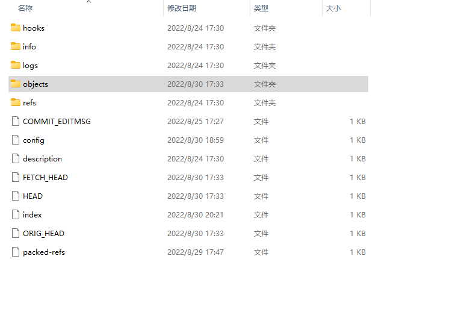

# 1.git目录
当在一个新目录或已有目录执行 git init 时，Git 会创建一个 .git 目录。 这个目录包含了 Git 存储
和操作的东西。
每一个仓库下都有一个.git文件夹，这里面存放项目所有配置数据和所要管理的数据。重要的有几个文件，HEAD config objects refs

- description 文件仅供 GitWeb 程序使用。 
- config 文件包含项目特有的配置 选项。 
- info 目录包含一个全局性排除（global exclude）文件， 用以放置那些不希望被记录在 
- .gitignore 文件中的忽略模式（ignored patterns）。 
- hooks 目录包含客户端或服务端的钩子脚本（hook scripts），

剩下的四个条目很重要：HEAD 文件、（尚待创建的）index 文件，和 objects 目录、refs 目录。 它们都是
Git 的核心组成部分。 
- objects 目录存储所有数据内容；
- refs 目录存储指向数据（分支、远程仓库和标签等）的提交对象的指针； 
- HEAD 文件指向目前被检出的分支；
- index 文件保存暂存区信息。

Git 是一个内容寻址文件系统.Git 的核心部分是一个简单的键值
对数据库（key-value data store）。 你可以向 Git 仓库中插入任意类型的内容，它会返回一个唯一的键，通过
该键可以在任意时刻再次取回该内容。
可以通过底层命令 `git hash-object` 来演示上述效果——该命令可将任意数据保存于 .git/objects 目录
（即 对象数据库），并返回指向该数据对象的唯一的键。
git hash-object 会接受你传给它的东西，而它只会返回可以存储在 Git 仓库中的唯
一键.此命令输出一个长度为 40 个字符的校验和。 这是一个 SHA-1 哈希值——一个将待存储的数据外加一个头部信息
（header）一起做 SHA-1 校验运算而得的校验和。
如果你再次查看 objects 目录，那么可以在其中找到一个与新内容对应的文件。 这就是开始时 Git
存储内容的方式——一个文件对应一条内容， 以该内容加上特定头部信息一起的 SHA-1 校验和为文件命名。 校
验和的前两个字符用于命名子目录，余下的 38 个字符则用作文件名.
一旦你将内容存储在了对象数据库中，那么可以通过 cat-file 命令从 Git 那里取回数据。 这个命令简直就是
一把剖析 Git 对象的瑞士军刀。 为 cat-file 指定 -p 选项可指示该命令自动判断内容的类型，并为我们显示大
致的内容：
```shell
$ git cat-file -p d670460b4b4aece5915caf5c68d12f560a9fe3e4
test content
```
git cat-file -t 命令，可以让 Git 告诉我们其内部存储的任何对象类型，只要给定该对象
的 SHA-1 值：
```shell
$ git cat-file -t 1f7a7a472abf3dd9643fd615f6da379c4acb3e3a
blob
```
## 1.1 HEAD
head直译过来过来是头，这代表当前分支的引用。查看文件信息，得知当前处于哪个分支
```shell
cat HEAD
ref: refs/heads/master

$ git branch -av
  dev                   6e93b7c test rebase
* master                6e93b7c test rebase
  remotes/origin/master 6e93b7c test rebase
```
*代表当前分支
## 1.1 config
代表当前仓库的配置信息，其中包括仓库配置email和name,还有config的几种类型system、local、global
```shell
cat config

[core]
        repositoryformatversion = 0
        filemode = false
        bare = false
        logallrefupdates = true
        symlinks = false
        ignorecase = true
[remote "origin"]
        url = https://github.com/xxxx/xxxx.git
        fetch = +refs/heads/*:refs/remotes/origin/*
[branch "master"]
        remote = origin
        merge = refs/heads/master
[user]
        email = xxxxx@aliyun.com
        name = xxxx

```
## refs
