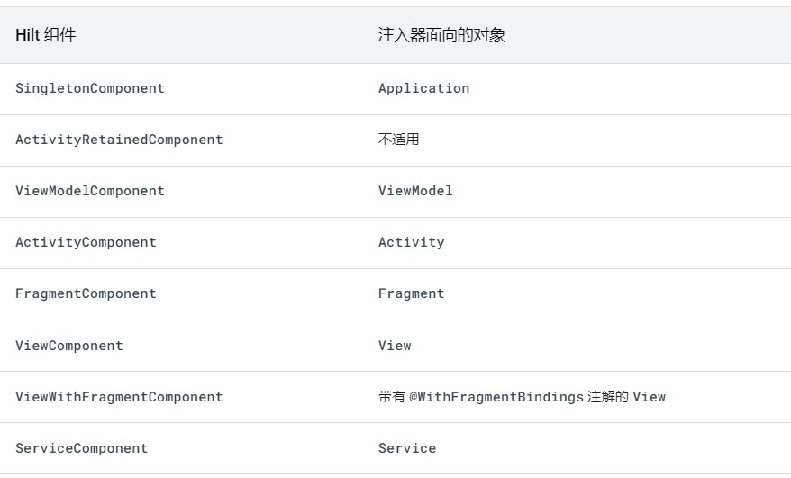
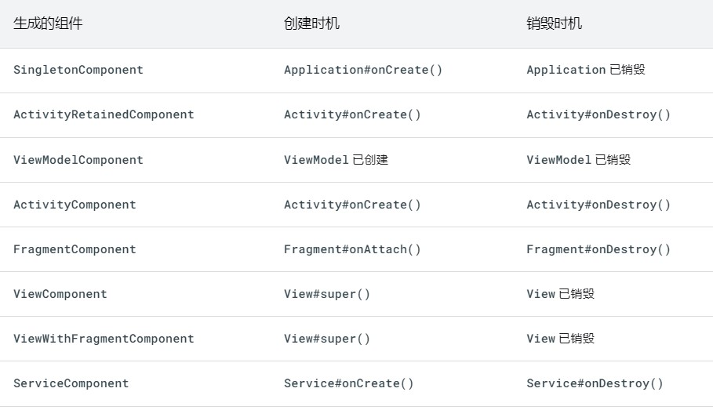

# 1.Android 中的依赖项注入


依赖项注入 (DI) 是一种广泛用于编程的技术，非常适用于 Android 开发。遵循 DI 的原则可以为良好的应用架构奠定基础。

实现依赖项注入可为您带来以下优势：

- 重用代码
- 易于重构
- 易于测试

## 1.1 依赖项注入基础知识

在专门介绍 Android 中的依赖项注入之前，本页提供了依赖项注入工作原理的总体概览。

### 什么是依赖项注入？

类通常需要引用其他类。例如，`Car` 类可能需要引用 `Engine` 类。这些必需类称为依赖项，在此示例中，`Car` 类依赖于拥有 `Engine` 类的一个实例才能运行。

类可通过以下三种方式获取所需的对象：

1. `类内部构造其所需的依赖项` 
2. 从其他地方抓取。某些 Android API（如 `Context` getter 和 `getSystemService()`）的工作原理便是如此。
3. 以参数形式提供。应用可以在`构造类时提供这些依赖项`，或者将这些依赖项传入需要各个依赖项的函数。在以上示例中，`Car` 构造函数将接收 `Engine` 作为参数。


Android 中有两种主要的依赖项注入方式：

- **构造函数注入**。 您将某个类的依赖项传入其构造函数。
- **字段注入（或 setter 注入）**。某些 Android 框架类（如 activity 和 fragment）由系统实例化，因此无法进行构造函数注入。使用字段注入时，依赖项将在创建类后实例化。

> **注意**：依赖项注入基于[控制反转](https://en.wikipedia.org/wiki/Inversion_of_control)原则，根据该原则，通用代码控制特定代码的执行。


### 自动依赖项注入

依赖项和类越多，手动依赖项注入就越繁琐。手动依赖项注入还会带来多个问题：

- 对于大型应用，获取所有依赖项并正确连接它们可能需要大量样板代码。在多层架构中，要为顶层创建一个对象，必须提供其下层的所有依赖项。例如，要制造一辆真车，可能需要引擎、传动装置、底盘以及其他部件；而要制造引擎，则需要汽缸和火花塞。
- 如果您无法在传入依赖项之前构造依赖项（例如，当使用延迟初始化或将对象作用域限定为应用流时），则需要编写并维护管理内存中依赖项生命周期的自定义容器（或依赖关系图）。

有一些库通过自动执行创建和提供依赖项的过程解决此问题。它们归为两类：

- 基于反射的解决方案，可在运行时连接依赖项。
- 静态解决方案，可生成在编译时连接依赖项的代码。

[Dagger](https://dagger.dev/) 是适用于 Java、Kotlin 和 Android 的热门依赖项注入库，由 Google 进行维护。Dagger 为您创建和管理依赖关系图，从而便于您在应用中使用 DI。它提供了完全静态和编译时依赖项，解决了基于反射的解决方案（如 [Guice](https://en.wikipedia.org/wiki/Google_Guice)）的诸多开发和性能问题。


## 1.2 依赖项注入的替代方法

依赖项注入的替代方法是使用[服务定位器](https://en.wikipedia.org/wiki/Service_locator_pattern)。服务定位器设计模式还改进了类与具体依赖项的分离。您可以创建一个名为服务定位器的类，该类创建和存储依赖项，然后按需提供这些依赖项。

```kotlin
object ServiceLocator {
    fun getEngine(): Engine = Engine()
}

class Car {
    private val engine = ServiceLocator.getEngine()

    fun start() {
        engine.start()
    }
}

fun main(args: Array) {
    val car = Car()
    car.start()
}
```

服务定位器模式与依赖项注入在元素使用方式上有所不同。使用服务定位器模式，类可以控制并请求注入对象；使用依赖项注入，应用可以控制并主动注入所需对象。

与依赖项注入相比：

- 服务定位器所需的`依赖项集合使得代码更难测试`，因为所有测试`都必须与同一全局服务定位器进行交互`。
- 依赖项在类实现中编码，而不是在 API Surface 中编码。因此，很难从外部了解类需要什么。所以，更改 `Car` 或服务定位器中可用的依赖项可能会导致引用失败，从而导致运行时或测试失败。
- 如果您想将作用域限定为除了整个应用的生命周期之外的任何区间，就会更难管理对象的生命周期。

## 1.3 在 Android 应用中使用 Hilt

[Hilt](https://developer.android.com/training/dependency-injection/hilt-android?hl=zh-cn) 是推荐用于在 Android 中实现依赖项注入的 Jetpack 库。Hilt 通过为项目中的每个 Android 类提供容器并自动为您管理其生命周期，定义了一种在应用中执行 DI 的标准方法。

Hilt 在热门 DI 库 [Dagger](https://developer.android.com/training/dependency-injection/dagger-basics?hl=zh-cn) 的基础上构建而成，因而能够受益于 Dagger 提供的编译时正确性、运行时性能、可伸缩性和 Android Studio 支持。

如需详细了解 Hilt，请参阅[使用 Hilt 实现依赖项注入](https://developer.android.com/training/dependency-injection/hilt-android?hl=zh-cn)。


# 2.必备知识


Hilt （刀把）是 Android 的依赖项注入库，专门面向Android的依赖注入框架。可减少在项目中执行手动依赖项注入的样板代码。执行手动依赖项注入要求您手动构造每个类及其依赖项，并借助容器重复使用和管理依赖项。

Hilt 通过`为项目中的每个 Android 类提供容器并自动管理其生命周期`，提供了一种在应用中`使用 DI（依赖项注入）`的标准方法

依赖注入的英文名是`Dependency Injection，简称DI`。`DI的最大作用就是解耦。本质其实在开发程序这块模块清晰，底层还是需要代码逻辑来去支撑的`，只不过通过这种技术把一些依赖关系给封装了而已。
## 2.1 MVVM
Android在复杂项目中，对象之间的依赖关系也十分可怕，所以Android如果依赖注入也能使项目结构更清晰。

谷歌推荐MVVM 架构来搭建Android应用。

- Activity/Fragment属于UI，View层
- ViewModel属于Viewmodel层，是View 和Model的交互的桥梁。和MVP模式很类似。
- Reponsitory属于Model层，主要提供数据来源，主要以网络和数据库为主。
## 2.2 Dagger2
Dagger（匕首）Dagger2也是依赖注入的框架，国内使用的不是太多。Dagger1前期是Square维护，主要以反射技术实现，但是反射很性能方面的问题。后期Google开始维护Dagger2，使用编译时期生成对象之间的各种依赖关系，这样编译期就可以知道报错信息，性能更好。Hilt是基于Dagger2之上做的进一步升级，所以学习Hilt学习下Dagger2的内容。
# 3 使用

## 1.添加依赖项

project--- build.gradle
```java
//project.build.gradle文件
classpath 'com.google.dagger:hilt-android-gradle-plugin:2.28-alpha'
```
module---build.gradle
```java
//module.build.gradle
apply plugin: 'kotlin-kapt'
apply plugin: 'dagger.hilt.android.plugin'

android {
    ...
}

dependencies {
    implementation "com.google.dagger:hilt-android:2.28-alpha"
    //类似于Java的注解处理器
    kapt "com.google.dagger:hilt-android-compiler:2.28-alpha"
}
//jdk 1.8
compileOptions {
    sourceCompatibility JavaVersion.VERSION_1_8
    targetCompatibility JavaVersion.VERSION_1_8
  }
```
## 2、@HiltAndroidApp
所有使用 Hilt 的应用都必须包含一个带有 @HiltAndroidApp 注释的 Application 类。

`@HiltAndroidApp` 会触发 Hilt 的代码生成操作，生成的代码包括应用的一个基类，该基类充当应用级依赖项容器。

生成的这一 Hilt 组件会附加到 `Application` 对象的生命周期，并为其提供依赖项。此外，它也是应用的父组件，这意味着，其他组件可以访问它提供的依赖项。 

```java
@HiltAndroidApp
public class ExampleApplication extends Application { ... }
```
Hilt一共支持6个入口点，分别是：

Application

`ViewModel`（通过使用 `@HiltViewModel`）

Activity
Fragment
View
Service
BroadcastReceiver


## 3、@AndroidEntryPoint、@Inject

在 Application 类中设置了 Hilt 且有了应用级组件后，Hilt 可以为带有 @AndroidEntryPoint 注释的其他 Android 类提供依赖项：

如果您使用 @AndroidEntryPoint 为某个 Android 类添加注释，则还必须`为依赖于该类的 Android 类添加注释`。例如，如果您为某个 Fragment 添加注释，则还必须为使用`该 Fragment 的所有 Activity` 添加注释。

```java
@AndroidEntryPoint
public class ExampleActivity extends AppCompatActivity { ... }
```

- Hilt 仅支持扩展 ComponentActivity 的 Activity，如 AppCompatActivity。
- Hilt 仅支持扩展 androidx.Fragment 的 Fragment。
- Hilt 不支持保留的 Fragment。

`@AndroidEntryPoint` 会为项目中的每个 Android 类生成一个单独的 Hilt 组件。这些组件可以从它们各自的父类接收依赖项，如[组件层次结构](https://developer.android.com/training/dependency-injection/hilt-android?hl=zh-cn#component-hierarchy)中所述。

如需从组件获取依赖项，请使用 @Inject 注释执行字段注入：

```java
@AndroidEntryPoint
public class ExampleActivity extends AppCompatActivity {
	//由 Hilt 注入的字段不能为私有字段
  @Inject
  AnalyticsAdapter analytics;
  ...
}
```
@AndroidEntryPoint注入的类的基类不能是抽象类。

## 4、 带参数的@Inject

```java
@AndroidEntryPoint
public class MainActivity extends AppCompatActivity {

    @Inject
    User user;


public class User {
    String name;
    Address address;

	@Inject
	public User( Address address) {
	
	    this.address = address;
	}
	...
}

public class Address {
    @Inject
    public Address() {
    }
}
```
MainActivity---》User--->Address
搞明白他们之间的依赖关系。
# 4.Hilt 模块   

有时，类型不能通过构造函数注入。发生这种情况可能有多种原因。例如，您不能通过构造函数注入接口。此外，您也不能通过构造函数注入不归您所有的类型，如来自外部库的类


## 1.@Module   @InstallIn

 @Module 注释的类代表是一个Hilt模块，它会告知 Hilt 如何提供某些类型的实例。且必须使用 @InstallIn 为 Hilt 模块添加注释，以告知 Hilt 每个模块将用在或安装在哪个 Android 类中。其实就是说明@module作用到什么范围。

任何一辆卡车都需要有引擎才可以正常行驶，那么这里我定义一个Engine接口，如下所示

```java
//启用引擎和关闭引擎。
interface Engine {
    fun start()
    fun shutdown()
}

//电动引擎
public class EleEngine implements Engine{
    @Inject
    public EleEngine () {
    }
    @Override
    public void start() {
        Log.d(TAG, "EleEngine  start: ");
    }

    @Override
    public void shutdown() {
        Log.d(TAG, "EleEngine  shutdown: ");
    }

    private static final String TAG = "EleEngine";
}
//常规引擎
public class GasEngine implements Engine{
	@Inject
    public GasEngine() {
    }
    @Override
    public void start() {
        Log.d(TAG, "GasEngine  start: ");
    }

    @Override
    public void shutdown() {

        Log.d(TAG, "GasEngine  shutdown: ");
    }

    private static final String TAG = "GasEngine";
}
```
创建一个EngineModule 抽象类，使用Module来修饰，说明它是一个模块，或者是一个清单，描述需要完成哪些对象的创建。
@InstallIn 直译按照到哪里，其实是作用到什么地方，传入ActivityCompent.class，作用到Activity对象上。


## 2.使用 @Binds 注入接口实例

以 `AnalyticsService` 为例。如果 `AnalyticsService` 是一个接口，则您无法通过构造函数注入它，而应向 Hilt 提供绑定信息，方法是在 Hilt 模块内创建一个带有 `@Binds` 注解的抽象函数。

`@Binds` 注解会告知 Hilt 在需要提供接口的实例时要使用哪种实现。

带有注解的函数会向 Hilt 提供以下信息：

- 函数返回类型会告知 Hilt 该函数提供哪个接口的实例。
- 函数参数会告知 Hilt 要提供哪种实现。

```kotlin
interface AnalyticsService {
  fun analyticsMethods()
}

// Constructor-injected, because Hilt needs to know how to
// provide instances of AnalyticsServiceImpl, too.
class AnalyticsServiceImpl @Inject constructor(
  ...
) : AnalyticsService { ... }

@Module
@InstallIn(ActivityComponent.class)
abstract class AnalyticsModule {

  @Binds
  abstract fun bindAnalyticsService(
    analyticsServiceImpl: AnalyticsServiceImpl
  ): AnalyticsService
}
```

Hilt 模块 `AnalyticsModule` 带有 `@InstallIn(ActivityComponent.class)` 注解，因为您希望 Hilt 将该依赖项注入 `ExampleActivity`。此注解意味着，`AnalyticsModule` 中的所有依赖项都可以在应用的所有 activity 中使用。

## 3.使用 @Provides 注入实例

接口不是无法通过构造函数注入类型的唯一一种情况。`如果某个类不归您所有`（因为它来自外部库，如 [Retrofit](https://square.github.io/retrofit/)、[`OkHttpClient`](https://square.github.io/okhttp/) 或 [Room 数据库](https://developer.android.com/topic/libraries/architecture/room?hl=zh-cn)等类），或者必须使用[构建器模式](https://en.wikipedia.org/wiki/Builder_pattern)创建实例，也无法通过构造函数注入。

如果 `AnalyticsService` 类不直接归您所有，您可以告知 Hilt 如何提供此类型的实例，方法是在 Hilt 模块内创建一个函数，并使用 `@Provides` 为该函数添加注解。

带有注解的函数会向 Hilt 提供以下信息：

- 函数返回类型会告知 Hilt 函数提供哪个类型的实例。
- 函数参数会告知 Hilt 相应类型的依赖项。
- 函数主体会告知 Hilt 如何提供相应类型的实例。每当需要提供该类型的实例时，Hilt 都会执行函数主体。

```
@Module
@InstallIn(ActivityComponent.class)
object AnalyticsModule {

  @Provides
  fun provideAnalyticsService(
    // Potential dependencies of this type
  ): AnalyticsService {
      return Retrofit.Builder()
               .baseUrl("https://example.com")
               .build()
               .create(AnalyticsService::class.java)
  }
}
```


## 4.为同一类型提供多个绑定  @Qualifier     ----限定符

如果您需要让 Hilt 以依赖项的形式`提供同一类型的不同实现`，必须向 Hilt 提供多个绑定。您可以使用限定符为同一类型定义多个绑定。

限定符是一种注解，当为某个类型定义了多个绑定时，您可以使用它来标识该类型的特定绑定。

仍然接着前面的例子来讲。如果需要拦截对 `AnalyticsService` 的调用，您可以使用带有[拦截器](https://square.github.io/okhttp/interceptors/)的 `OkHttpClient` 对象。对于其他服务，您可能需要以不同的方式拦截调用。在这种情况下，您需要告知 Hilt 如何提供两种不同的 `OkHttpClient` 实现。

首先，定义要用于为 `@Binds` 或 `@Provides` 方法添加注解的限定符：

```kotlin
@Qualifier
@Retention(AnnotationRetention.BINARY)
annotation class AuthInterceptorOkHttpClient

@Qualifier
@Retention(AnnotationRetention.BINARY)
annotation class OtherInterceptorOkHttpClient
```

然后，Hilt 需要知道如何提供与每个限定符对应的类型的实例。在这种情况下，您可以使用带有 `@Provides` 的 Hilt 模块。这两种方法具有相同的返回类型，但限定符将它们标记为两个不同的绑定：

```kotlin
@Module
@InstallIn(SingletonComponent::class)
object NetworkModule {

  @AuthInterceptorOkHttpClient //?????
  @Provides
  fun provideAuthInterceptorOkHttpClient(
    authInterceptor: AuthInterceptor
  ): OkHttpClient {
      return OkHttpClient.Builder()
               .addInterceptor(authInterceptor)
               .build()
  }

  @OtherInterceptorOkHttpClient//?????
  @Provides
  fun provideOtherInterceptorOkHttpClient(
    otherInterceptor: OtherInterceptor
  ): OkHttpClient {
      return OkHttpClient.Builder()
               .addInterceptor(otherInterceptor)
               .build()
  }
}
```

您可以通过使用相应的限定符为字段或参数添加注解来注入所需的特定类型：


```kotlin
// As a dependency of another class.
@Module
@InstallIn(ActivityComponent.class)
object AnalyticsModule {

  @Provides
  fun provideAnalyticsService(
    @AuthInterceptorOkHttpClient //?????
      okHttpClient: OkHttpClient  
  ): AnalyticsService {
      return Retrofit.Builder()
               .baseUrl("https://example.com")
               .client(okHttpClient)
               .build()
               .create(AnalyticsService::class.java)
  }
}

// As a dependency of a constructor-injected class.
class ExampleServiceImpl @Inject constructor(
  @AuthInterceptorOkHttpClient //?????
    private val okHttpClient: OkHttpClient
) : ...

// At field injection.
@AndroidEntryPoint
class ExampleActivity: AppCompatActivity() {

  @AuthInterceptorOkHttpClient//?????
  @Inject lateinit var okHttpClient: OkHttpClient
}
```

## 5、Hilt 中的预定义限定符

Hilt 提供了一些预定义的限定符。例如，由于您可能需要来自应用或 activity 的 `Context` 类，因此 Hilt 提供了 `@ApplicationContext` 和 `@ActivityContext` 限定符

```kotlin
class AnalyticsAdapter @Inject constructor(
    @ActivityContext private val context: Context,
    private val service: AnalyticsService
) { ... }
```


# 5.为 Android 类生成的组件

执行字段注入的每个 Android 类，都有一个关联的 Hilt 组件，您可以在 @InstallIn 注释中引用该组件。每个 Hilt 组件负责将其绑定注入相应的 Android 类。Hilt 不会为广播接收器生成组件，因为 Hilt 直接从 ApplicationComponent (SingletonComponent)注入广播接收器。

`@InstallIn(ActivityComponent::class)`，就是把这个模块安装到Activity组件当中。既然是安装到了Activity组件当中，那么自然`在Activity中是可以使用由这个模块提供的所有依赖注入实例`。另外，`Activity中包含的Fragment和View也可以使用`，但是除了Activity、Fragment、View之外的其他地方就无法使用了



## 1.组件生命周期




## 2 组件作用域

默认情况下，Hilt 中的所有绑定都未限定作用域。这意味着，每当应用请求绑定时，Hilt 都会创建所需类型的一个新实例。


## 3.组件层次结构


简单来讲，就是对某个类声明了某种作用域注解之后，这个注解的箭头所能指到的地方，都可以对该类进行依赖注入，同时在该范围内共享同一个实例。

比如@Singleton注解的箭头可以指向所有地方。而@ServiceScoped注解的箭头无处可指，所以只能限定在Service自身当中使用。@ActivityScoped注解的箭头可以指向Fragment、View当中。

